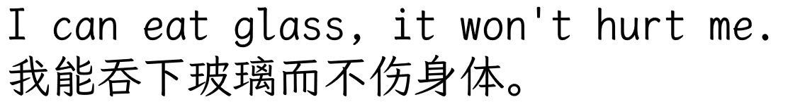
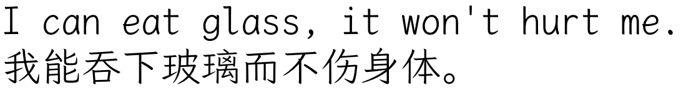
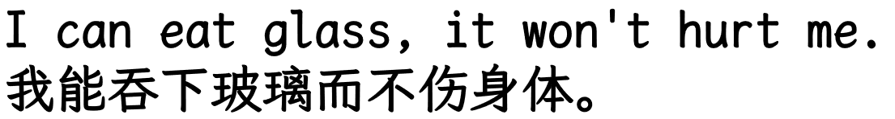
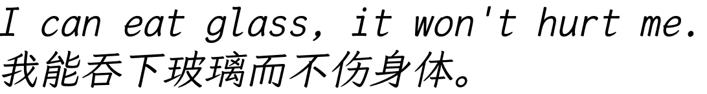

# LIBExt Kai GB (Former LBIExt Kai Mono GB)

> **⚠️ Important Notice**  
> This repository is an ** unofficial derivative version ** of ** LXGW WenKai Mono GB **, adding bold/italic/light styles.  
> The font name has been removed of "霞鹜 / LXGW" as required by the license, ** not maintained by the original developers **.
> Since the bold and italic versions of this font are generated by machine, I only make slight adjustments to certain fonts, so the bold and italic versions of this font may not be satisfactory and might appear blurry.

---

## Font Preview
Regular (Base):  
  
Light (Base):  
  
Bold:  
  
Italic:  
  

---

## Download and Install
### Direct Download of Compiled Version
Go to the [Release Page](https://github.com/scilxurkel001/LLIBExtKaiGB/releases) to download

### Manual Installation
1. Download the `.ttf` file
2. Double-click to install or copy to the system font directory:
   - **Windows**: `C:\Windows\Fonts`
   - **macOS**: `/Library/Fonts/`
   - **Linux**: `~/.local/share/fonts/`

---

## License and Copyright
### Font License
**SIL OPEN FONT LICENSE Version 1.1**  
Full terms see [OFL.txt](OFL.txt)

### Copyright Notice
```
Copyright 2025 Scilxurkel; 
Copyright 2022-2025 LXGW; 
Copyright 2020 The Klee Project Authors
```
- This derivative project is based on [LXGW WenKai Mono GB](https://github.com/lxgw/LxgwWenKai)
- Original design comes from the Klee font by Fontworks Inc.

### Derivative Guidelines
- Font name complies with the original project requirements, not using the "霞鹜 / LXGW" reserved name

---

## Frequently Asked Questions
### Q: Is this the official version of LXGW WenKai?
**No**. This is a **independent derivative version**, the original project can be accessed at [Official Repository](https://github.com/lxgw/LxgwWenkaiGB).

### Q: Why is "Xia Wu" not in the name?
According to the original font license terms, derivative works **are prohibited from using the "霞鹜 / LXGW" name**. "Kai" refers to the general category, which complies with the regulations.

### Q: Will it conflict with the official version?
No. This font uses an independent namespace (`LBIExt Kai Mono GB`), and can coexist with the official font.

---

## Contribution and Feedback
Welcome to submit via [Issues](https://github.com/scilxurkel001/LIBExtKaiGB/issues):
- Glyph issues (missing/modified characters)
- Style optimization suggestions
- Technical compatibility issues

*Note: No requests for core design modifications of the original font will be accepted*

---
> 🖋️ **Derivative Statement**  
> This project respects and preserves all rights of the original developers (LXGW),  
> Modifications are limited to style expansion and compliant renaming, without changing the original design philosophy.
